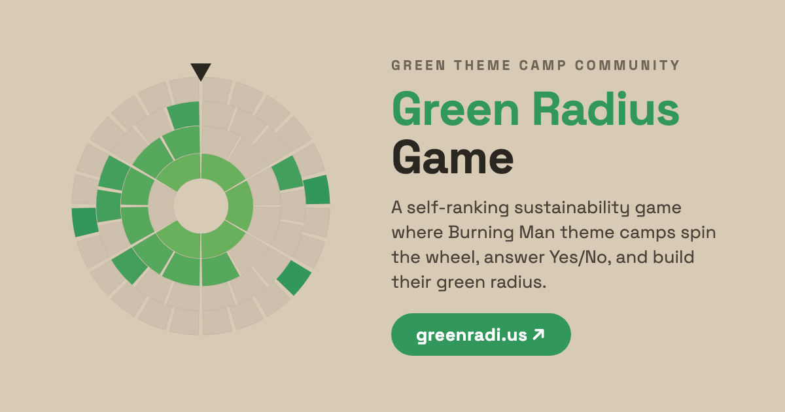

# Green Radius Game

A self-ranking sustainability game for Burning Man theme camps. Each spin of the
wheel plays one of six sectors — Food, Water, Waste, Transport, Shelter, Power —
answering its ten Yes/No questions across four progressively harder tiers. Every
Yes fills one segment of that tier's ring — gaps are fine, there's no penalty for
a skipped question. Six spins, one per sector, build your camp's unique Green
Radius.

Live at **https://greenradi.us**.

<p align="center">
  
</p>

The mechanics and copy come from the Green Theme Camp Community's BLAST framework;
this implementation began from a Claude Design handoff bundle.

## Features

- **Play two ways** — spin the wheel one sector at a time (board-game mode) or fill
  the whole thing out as a form. Same questions, same scoring.
- **Six sectors, four tiers each** — Food, Water, Waste, Transport, Shelter, Power,
  with each tier asking for more than the last.
- **Shareable result card** — every finished game gets a permanent link
  (`/result/…`) with a rendered card, handed to the OS share sheet or copied to post.
- **Green-Up Plan** — on the done screen, every "No" becomes a concrete next-year
  suggestion, grouped by sector.
- **Public city tally** — [`/city/`](https://greenradi.us/city/) rolls every camp's
  results into one community-wide radius, aggregate-only, no login.
- **Printable board game** — [`downloads/`](downloads/) has PDFs for playing on paper
  at camp, no phone required.

## Stack

- Static HTML + React 18 (UMD, vendored same-origin in `vendor/`), with in-browser JSX via `@babel/standalone`
- **No build step** — the browser compiles the JSX
- A small **Cloudflare Worker** (`worker/index.js`) backs five dynamic routes:
  `POST /api/complete` (saves a result row to a Google Sheet and emails the camp a
  shareable link), the Cloudflare Access–gated `GET /api/admin/responses` (the
  read path behind the internal admin viewer), `GET /api/city` (the public,
  aggregate-only community tally behind the `/city/` page, colo-cached ~5 min),
  `GET /result/?r=…` (rewrites the result page's Open Graph title and description
  for a per-camp share unfurl, pinned to the Worker via `run_worker_first` in
  `wrangler.jsonc`), and `GET /api/health` (a liveness probe for the external
  uptime monitor). Everything else is served as static assets.
- Deployed on **Cloudflare Workers + Static Assets**

## Layout

| Path               | Role                                                            |
|--------------------|-----------------------------------------------------------------|
| `index.html`       | Entry point; mounts `<GreenRadiusGame/>`                        |
| `green-radius.jsx` | Main game component (`GreenRadiusGame`) — game state, done screen, Green-Up Plan; loads last |
| `src/`             | The rest of the game UI (shared Babel scope): core, fx, badge, wheel, question flow, share card, home, form mode |
| `game-data.js`     | `window.SECTORS` — sector / tier / question content             |
| `result-state.js`  | `window.ResultState` — encode/decode a result to/from the `?r=` share payload (legacy `#hash` fallback) |
| `rank.js`          | `window.Rank` — maps the 0–60 total to a playa-rank title ("First Spark"…"Green Supernova"); shared by the done screen and the Worker's OG description |
| `result/`          | Stateless shareable result page                                 |
| `city/`            | Public community-progress page (`/city/`), rendered from `GET /api/city` |
| `admin/`           | Internal Cloudflare Access–gated response viewer (City + Camps), read-only |
| `worker/`          | Cloudflare Worker (`/api/complete` + `/api/admin/responses` + `/api/city` + `/result/?r=` OG unfurl + `/api/health`) |
| `vendor/`          | Pinned React/ReactDOM/Babel runtime, served same-origin        |
| `downloads/`       | Printable board-game + how-to-play PDFs                          |

## Architecture

The end-to-end wiring — data flow, the `/api/complete` contract, and the external
integrations (Google Sheets via Apps Script, Resend, Cloudflare) — lives in
[`docs/architecture.md`](docs/architecture.md).

## Run locally

Any static server works for the UI:

```bash
python3 -m http.server 8000
# open http://localhost:8000
```

(`file://` won't work — browsers block cross-origin `<script src>` reads.) To run the
Worker/API locally too, use `npx wrangler dev`. See
[CONTRIBUTING.md](CONTRIBUTING.md) for the full dev + contribution flow.

## Deploy

Hosted on Cloudflare Workers + Static Assets. **Merging to `main` auto-deploys to
https://greenradi.us** — there is no separate staging environment, and `main` is
branch-protected, so changes land via pull request.

Manual deploy, if ever needed (requires Node.js):

```bash
npx wrangler deploy
```

The Worker's secrets (`SHEETS_WEBAPP_URL`, `SHEETS_SHARED_SECRET`, `RESEND_API_KEY`)
are stored in Cloudflare and never committed.

## Contributing

See [CONTRIBUTING.md](CONTRIBUTING.md). New contributors join as collaborators on this
repo (it's the canonical one) and open PRs against `main`.

## License

MIT — see `LICENSE`.
